# SENTRA

*Sense the Risk · Stop the Incident*

> Workers report near-misses every day. SENTRA reads each report the moment it is
> written, finds the ones that could have killed someone, shows why, and asks a
> person to confirm.

Prototype for **Oil India Limited — Problem Statement 26165**: turning raw
Unsafe Act / Unsafe Condition (UA/UC) and near-miss reports into structured,
decision-grade **SIF (Serious Injury & Fatality) intelligence**.
The application is `sentra.py`; `sif/` remains the engine's package name, and the
settings folder keeps its old name (`SIF Insight Console`) so an existing
operator's accounts, audit trail and review decisions are not orphaned.

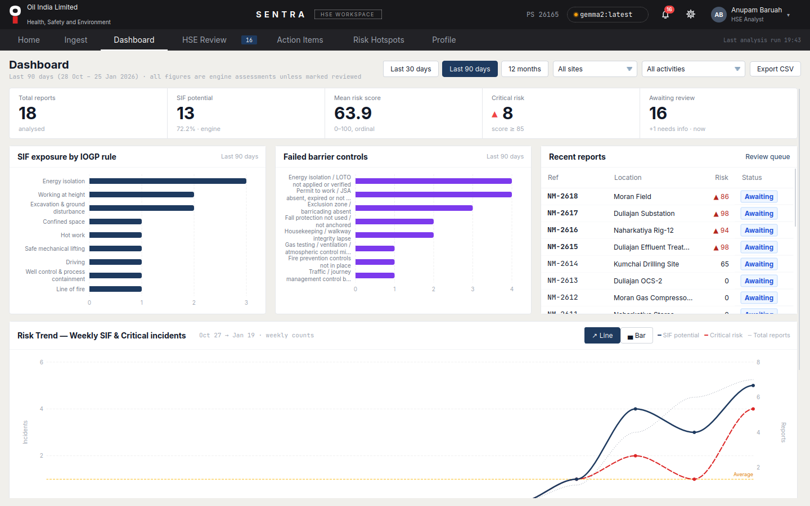

*The HSE Dashboard: five headline figures, SIF exposure by IOGP rule, failed
barrier controls, the latest reports and the weekly risk trend.*

> **Start here:** [USING_SENTRA.md](USING_SENTRA.md) — the click-by-click flow,
> from first launch to working the review queue.
>
> **Operating manual:** [INSTRUCTION.md](INSTRUCTION.md) — the rules the system
> must be used under, install and daily process, how to train the model on
> reviewed labels, and what has to change before it is trusted on live safety
> data.
>
> **Building the installer:** [packaging/INNO_SETUP.md](packaging/INNO_SETUP.md)
> — PyInstaller and Inno Setup, step by step, and how to publish a release.
>
> **Architecture, test and gap report:** [reports/report.pdf](reports/report.pdf)
> — how the engine decides, the models and data, every test result, and what is
> still missing.

## What SENTRA is today

| | |
| --- | --- |
| **One sign-in, two workspaces** | The account decides which one opens. An **HSE Analyst** ingests, analyses, decides review cases, tracks compliance actions and investigates hotspots. An **Administrator** runs the engines, settings, logs, accounts and data - and records no review decisions, so platform control and safety judgement stay in separate hands. |
| **The engine** | Three opinions on every report - deterministic IOGP rules, a semantic encoder and a learned XGBoost model - fused so recall only grows, with the evidence for every verdict. |
| **gemma2:latest, always on** | The local LLM (through Ollama) is switched on from the start as a fourth opinion and the translator for reports not written in English. A button in the title row shows whether it is answering. |
| **Asset Safety Memory** | Every asset's incidents, near misses, hazards, control failures, SIF precursors and corrective actions. Each new report is read against its asset's history for recurring hazards, repeated control failures and emerging SIF-precursor scenarios. |
| **Work-Hold Recommendation** | *Continue*, *HSE Review Required* or *Work-Hold Recommended* for every report, with each factor behind it and its weight. Holds lead Home, have their own review filter and are written to the audit log. |
| **Human review** | Nothing the engine calls SIF-potential closes without a person. Decisions are signed, persisted and become the labels training uses. |
| **Local SQL database** | Every report, decision, action item and audit entry is kept in SQLite (or a shared PostgreSQL / MySQL server) and loaded at the next start. |
| **Vector database** | Each report's embedding, for "find reports like this one". |
| **Data sync and cloud backup** | Sync workstations through the shared database; back everything up, encrypted, to a synced cloud folder, S3-compatible storage or WebDAV, on demand or on a schedule; verify and restore. |
| **A tamper-evident trail** | Every action is written to a hash-chained audit log with the person who did it. |

## The HSE workspace

| | |
| --- | --- |
| 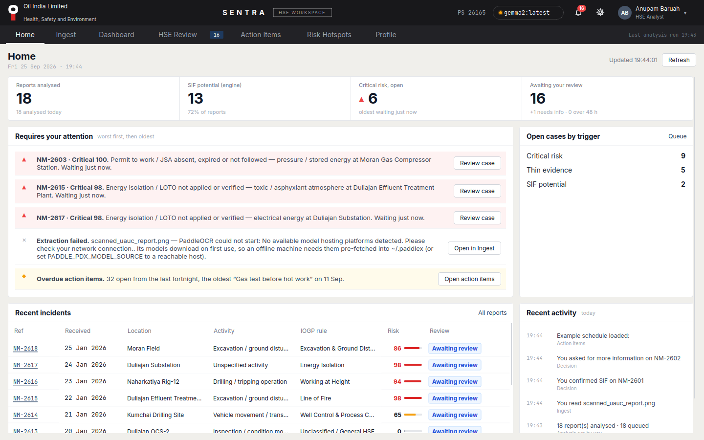 | 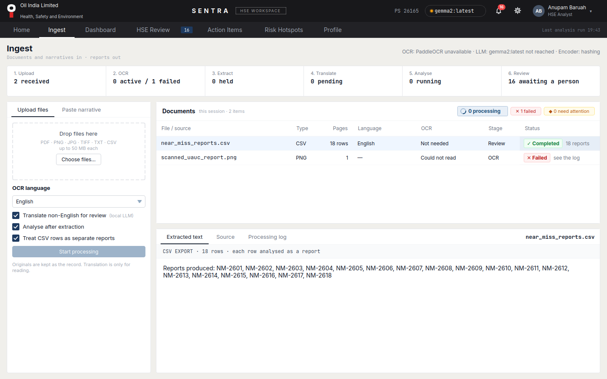 |
| **Home** — what needs you now: critical cases oldest first, open cases by trigger, recent incidents and your recent activity. | **Ingest** — CSV exports, PDFs, scans and photographs, or a pasted narrative, through OCR, extraction, translation and analysis, with a log per document. |
|  | 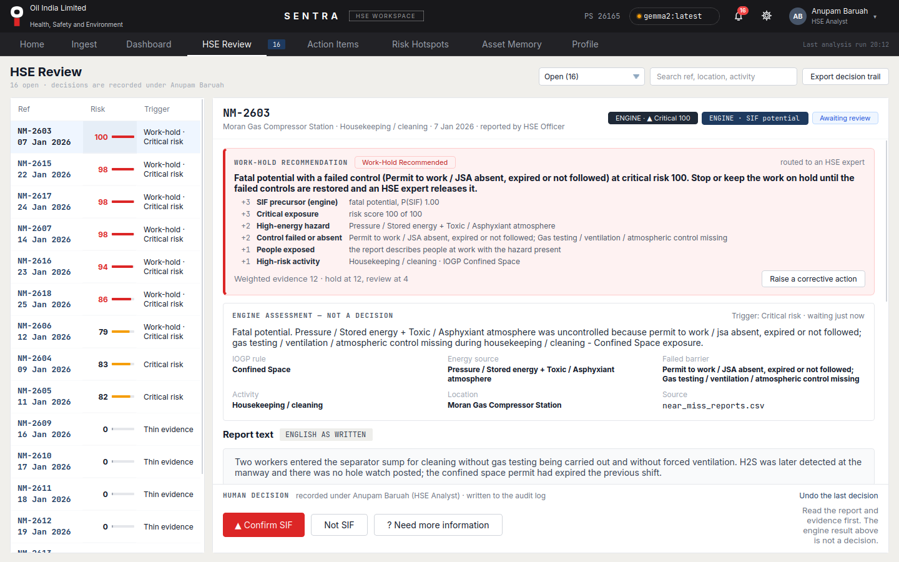 |
| **Dashboard** — last 30 / 90 days or 12 months, by site and activity: SIF exposure by rule, failed barriers, recent reports and the weekly trend (line or bar). | **HSE Review** — the case list beside the case: the work-hold recommendation, engine assessment (not a decision), the report in English, the asset's memory, the report's decision history, evidence and reasoning, and three keys to decide it. **Decision trail** switches to every decision recorded, standing or superseded, filterable by reviewer and decision, exportable. |
| 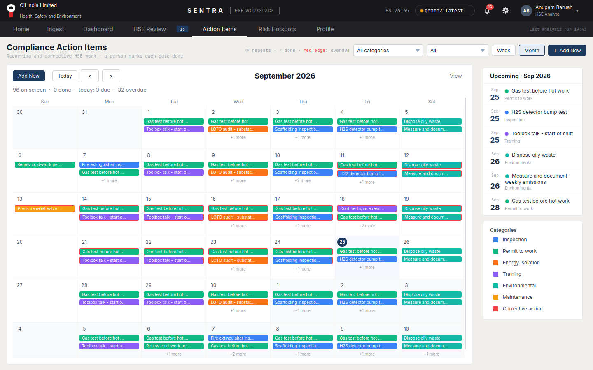 | 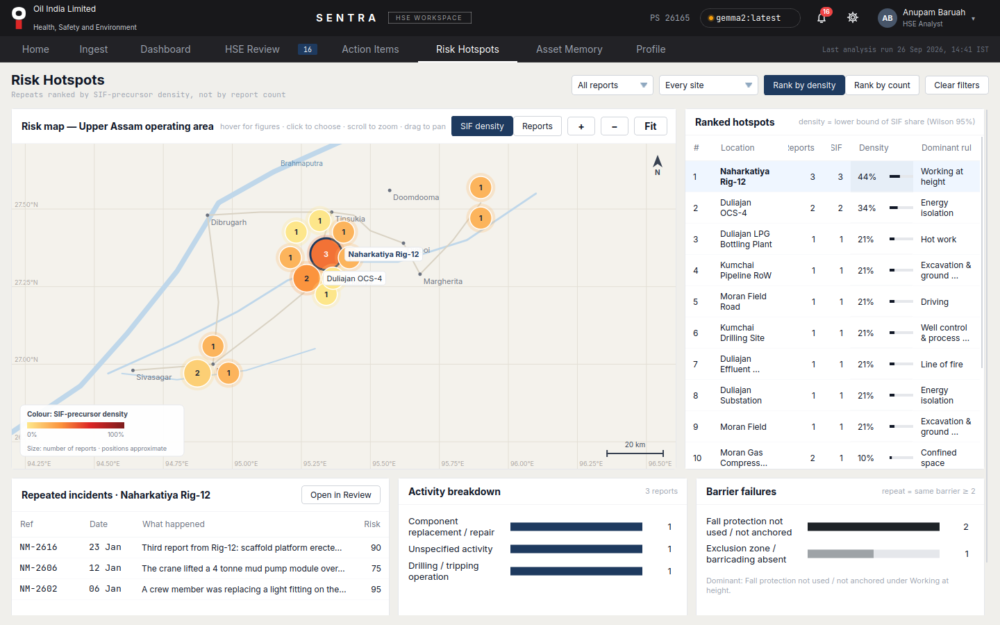 |
| **Action Items** — the compliance calendar: recurring and corrective HSE work by category, month or week, with what is due next. | **Risk Hotspots** — an interactive map of the Upper Assam operating area: each site at its locality, sized by reports and coloured by SIF-precursor density (Wilson lower bound); hover for figures, click to choose, scroll to zoom, drag to pan. Beside it the ranked table; below, the chosen site's incidents, activities and barrier failures. |
| 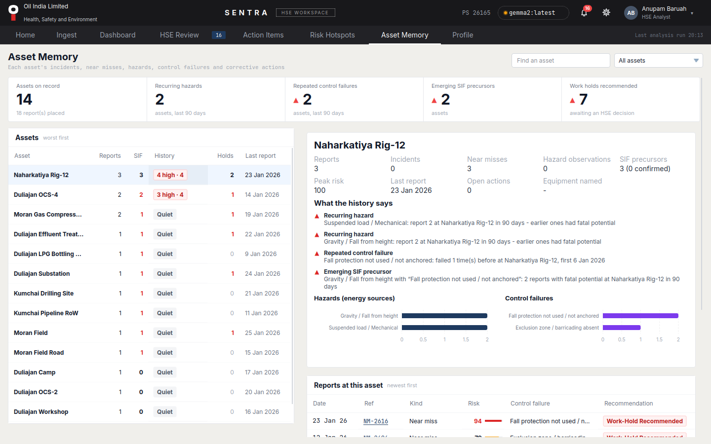 | 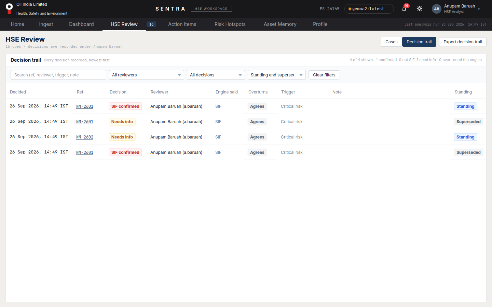 |
| **Asset Memory** — every asset, worst first: its reports by kind, what its history says, its hazards and control failures, its reports with their recommendations, and its corrective actions. | **Decision trail** — every review decision, when (with the zone), by whom, what the engine said, whether it overturned it, and whether it still stands. |

**Profile** holds the person's details, password change, preferences, their own
activity and their sign-in history.

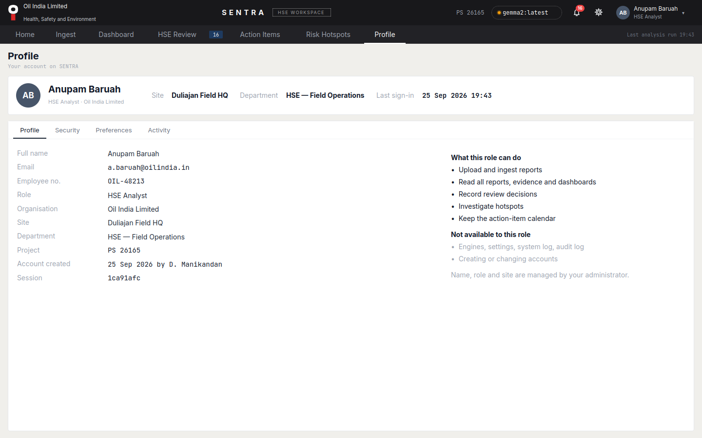

## Administration

| | |
| --- | --- |
| 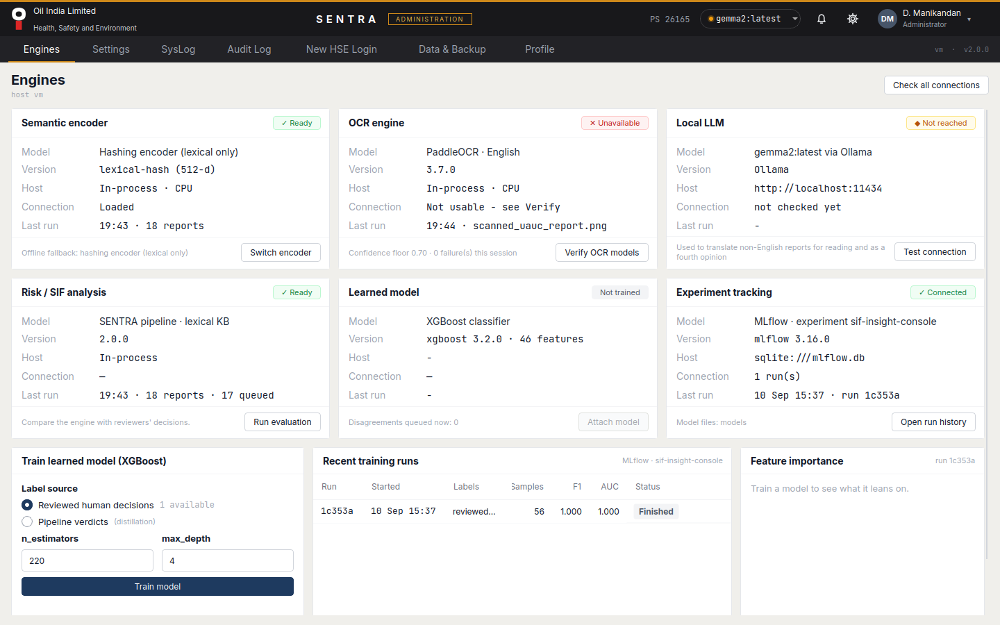 | 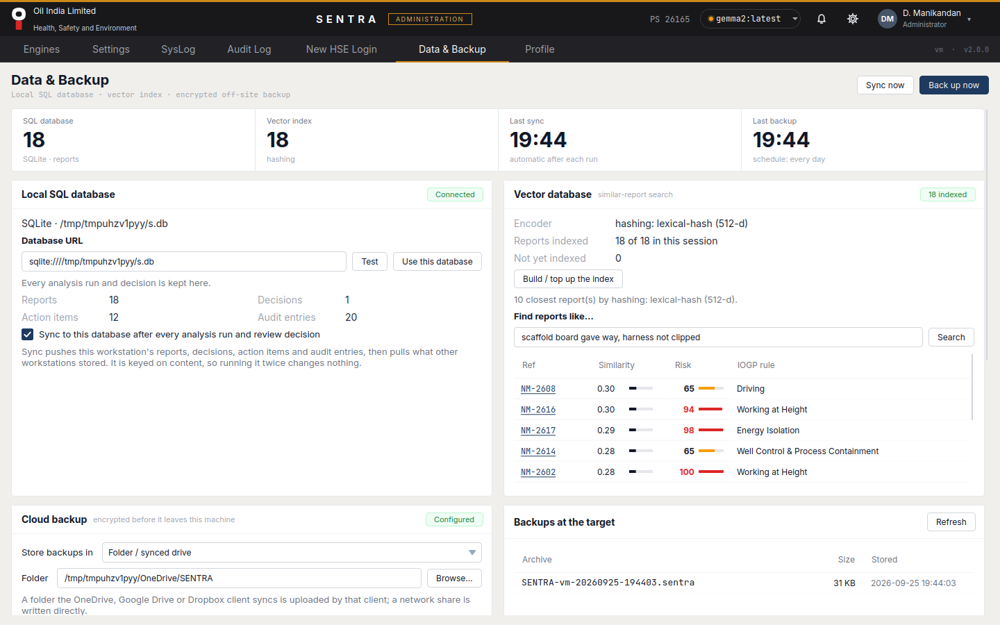 |
| **Engines** — the encoder, OCR, the local LLM, the learned model and the risk scorer: what is installed, whether it is running, and the controls for each. | **Data & Backup** — the SQL database, the vector index, cloud backup and the sync log (see below). |
| 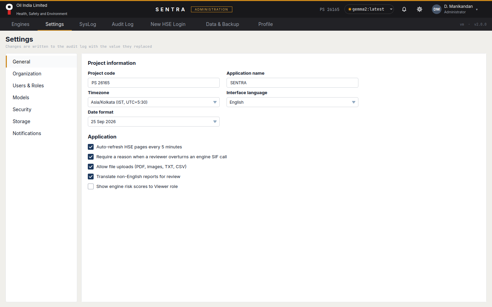 | 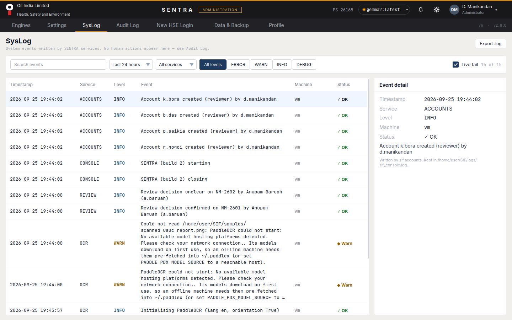 |
| **Settings** — General, Organization, Users & Roles, Models, Security, Storage and Notifications; e.g. a reason required to overturn the engine. Every change is audited with the value it replaced. | **SysLog** — what the software did, service by service, with a live tail and export. |
| 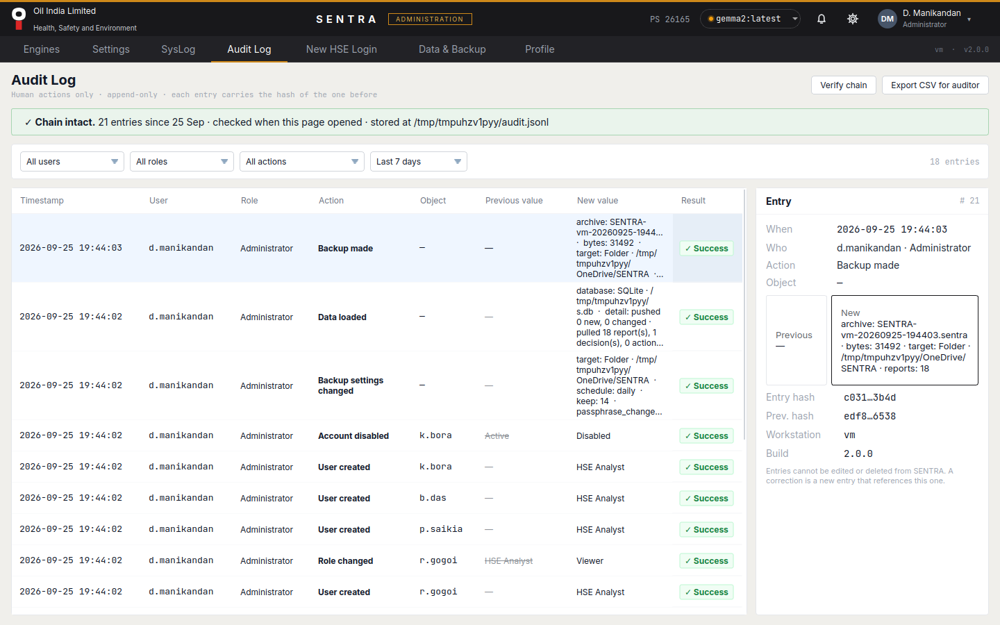 | 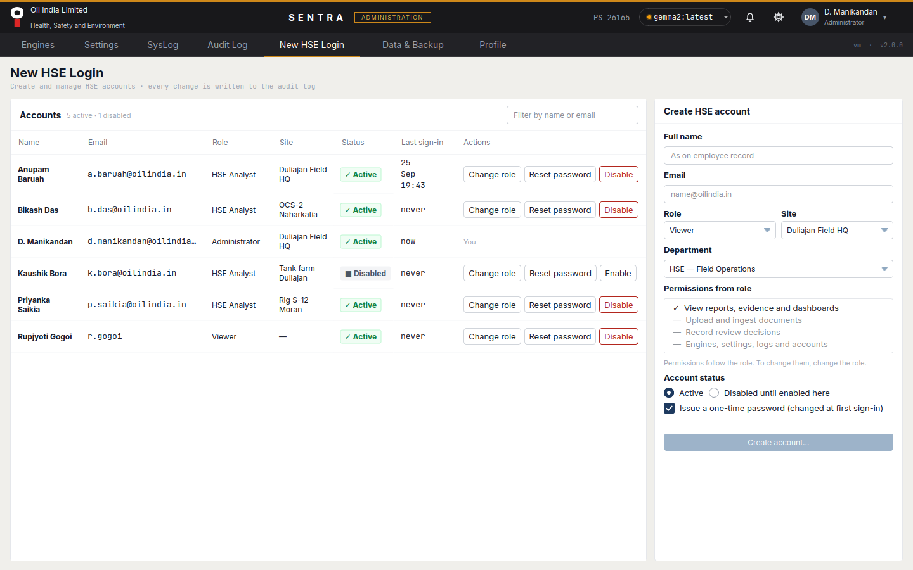 |
| **Audit Log** — what people did, hash-chained, with the previous and new value of every change and a check of the chain. | **New HSE Login** — create accounts with a one-time password, change roles, reset passwords, disable and enable. |

## Asset Safety Memory and Work-Hold Recommendation


### Asset Safety Memory (`sif/assets.py`)

An **asset** is the installation a report is about - an OCS, a rig, a
compressor station, a substation - named by the export's `site` column or, when
there is none, the location the engine read from the text. Its memory holds:

* every report, read from its own wording as an **incident** (someone hurt,
  something damaged or released), a **near miss** (people at work with the
  hazard present, or stopped in time) or a **hazard observation** (a condition
  found with no one exposed);
* the **hazards** (high-energy sources) and **control failures** (barriers
  failed or absent) the engine found;
* the **SIF precursors**, and which ones an HSE reviewer confirmed or rejected;
* the **corrective actions** raised against its reports - open, overdue or done;
* the **equipment tags** its reports name (`P-3B`, `GGS-5`, `K-101`).

Each new report is read against what came before at the same asset (the last
90 days) and raises **signals** for the reviewer:

| Signal | When |
| --- | --- |
| Recurring hazard | The same energy source was reported at this asset before; *high* when an earlier one had fatal potential. |
| Repeated control failure | The same barrier failed here before. |
| Corrective action did not hold | An action closed for an earlier report, and the same control failed again. |
| Emerging SIF precursor | The same hazard-and-failed-control scenario with fatal potential again, or more precursors in the last 30 days than the 30 before. |
| Confirmed precursor on record | An HSE reviewer confirmed SIF potential on an earlier report here. |
| Open corrective action | Actions still open or overdue at this asset. |

The memory is derived from the reports, decisions and actions SENTRA keeps, so
it can never disagree with them. It is also written to the SQL database
(`asset_memory`), so other workstations and reporting tools can read it.

### Work-Hold Recommendation (`sif/workhold.py`)

Every report gets **Continue**, **HSE Review Required** or **Work-Hold
Recommended**, from six kinds of evidence, each shown with its weight:

| Evidence | Weight |
| --- | --- |
| Hazards: a high-energy source | +2 |
| SIF precursor: the engine's fatal-potential verdict; the learned model or the local LLM agreeing | +3; +1 |
| Failed or absent controls | +2 |
| Exposure severity: critical risk (≥ 85) or high (≥ 50); people exposed | +3 or +1; +1 |
| Activity context: work the Life-Saving Rules single out (isolation, confined space, height, lifting, hot work, excavation, live electrical, well operations) | +1 |
| Asset history: repeated control failure, a corrective action that did not hold, an emerging precursor, a recurring hazard, a confirmed precursor, overdue actions | +1 to +3 each |

The rules, in one paragraph: **Work-Hold Recommended** when the report has
fatal potential *and* a failed or absent control *and* either critical
exposure or an asset history of that control failing again, a corrective
action not holding or an emerging precursor - or when the weighted evidence
reaches 12. **HSE Review Required** for fatal potential, a risk of 50 or more, a
high-energy source with a failed control, a significant history signal, or
weighted evidence of 4 or more. **Continue** otherwise.

A recommendation is advice to a person, never an order:

* Holds and reviews are **routed to HSE experts**: holds lead *Home*, have a
  *Work-hold* filter at the top of *HSE Review*, carry "Work-hold" in the case
  list, and each new hold is written to the audit log once (`work-hold
  recommended`, with the asset, the reason and the score).
* The case shows the recommendation above the engine assessment, every factor
  with its evidence, and **Raise a corrective action** linked to the report.
* A reviewer's decision stands beside it: judging a report *not SIF* releases
  the hold (recorded as the reason); confirming SIF keeps it at least under
  review. If the report says the work was already stopped, the advice is to
  keep it stopped until the controls are restored.
* Recommendations are written to the SQL database (`work_holds`).

## Everyday details

* **Clear and Cancel.** Every text field has a clear (×) button. Filters have
  *Clear filters* (Dashboard, HSE Review, Asset Memory, Action Items, Risk
  Hotspots, Audit Log, SysLog); forms have *Clear* (the pasted narrative, the
  password change, *Clear form* on New HSE Login) or *Cancel changes* (the
  backup settings). Ingest has **Cancel processing** while a document is being
  read or analysed - what was already analysed is kept - and *Clear list*. The
  first-sign-in password change can be cancelled; every dialog has Cancel.
* **Dates and times, one way.** Everything follows the date format and time
  zone chosen in *Settings* (Asia/Kolkata by default) and names the zone:
  `25 Sep 2026, 14:06 IST`. A report's own date is a calendar date and is never
  shifted. The dashboard says when it was updated, the recent reports say when
  each was reported, the weekly trend names its weeks with the year, and a
  review case says when the report was made and when it was analysed.
* **No score of 100.** The risk score is capped at 95 and P(SIF) at 0.95: a
  machine reading of free text is never certain. The critical band starts at
  85, so no report's band, queue place or recommendation changes.

## The title row

| |
| --- |
| 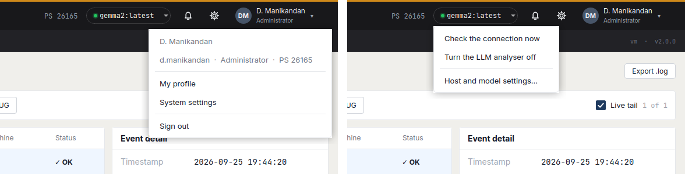 |

* **The OIL emblem**, the organisation and "Health, Safety and Environment" on
  the left; **SENTRA** and the workspace in the middle.
* **gemma2:latest** — the local LLM's state as a coloured dot: **green** ready,
  **amber** checking or the model not pulled yet (`ollama pull gemma2:latest`),
  **red** the Ollama host is not answering (reports are still analysed by the
  other three engines; the LLM opinion and translation wait until it answers),
  **grey** switched off by an administrator. Press it to check again. For an
  administrator the arrow opens *Check the connection now*, *Turn the LLM
  analyser off / on* and *Host and model settings…*; nobody else can switch it
  off, and the choice is kept between sessions.
* **The bell** counts what needs a person: cases waiting in the HSE workspace;
  in Administration, today's refused sign-ins and permission refusals plus any
  outstanding password reset requests.
* **The account menu** — name, username, role and project, then *My profile*,
  *Preferences* / *System settings* and *Sign out*.

Every menu and drop-down list opens white with dark text wherever it is opened
from, including the dark title row, and a test measures the rendered pop-up so
it cannot turn transparent (black on Windows) again.

## Sign-in and a record of who did what

| | |
| --- | --- |
| 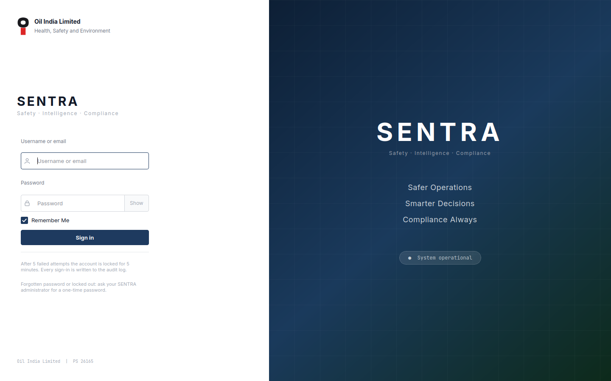 | 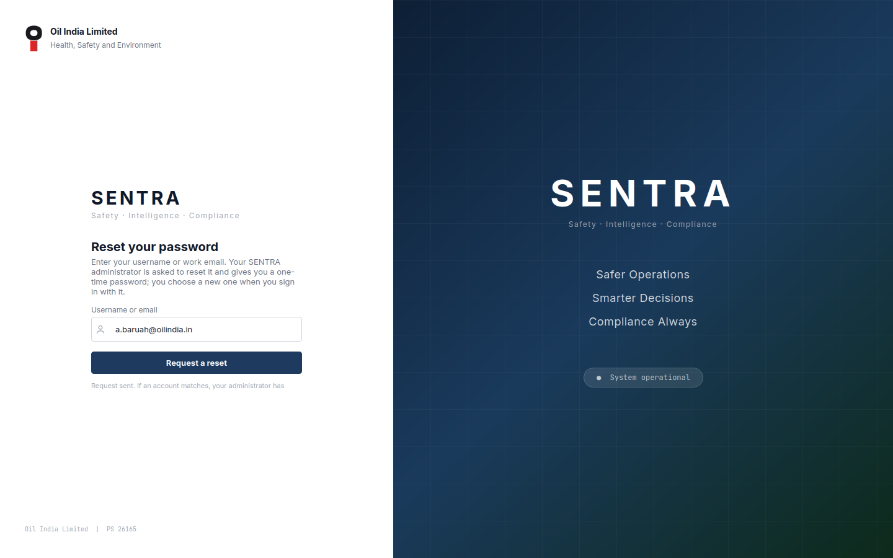 |

* **No default password.** The first start on a machine creates the
  administrator; everyone else is created on *New HSE Login* and signs in by
  username or email with a one-time password they must change.
* **Forgot password?** Beside *Remember Me*. There is no mail service to send
  a link, so the request goes where a reset can actually happen: it is written
  to the audit log, the administrator's bell counts it (and opens *New HSE
  Login*), and the account is marked **Reset requested** until a one-time
  password is issued, which the person replaces at their next sign-in. The
  reply is the same whether or not the account exists, so the page cannot be
  used to find out who has one.
* **Passwords are never stored** — a salted PBKDF2-HMAC-SHA256 digest at 600,000
  iterations. Five wrong attempts lock an account for five minutes.
* **Every record names its person.** Each analysed report says who analysed it,
  each review decision is signed by the person signed in, and every audit entry
  carries the user.
* **The check is on the action, not the button.** A refused action is refused
  from a click, a shortcut or a menu alike, and the refusal is itself audited.

## Data, sync and backup

All of this is on the administrator's **Data & Backup** tab.

* **Local SQL database.** `sentra.db` (SQLite) sits beside the accounts and the
  audit trail in the per-user folder. Every analysis run, review decision and
  action item is written to it as it happens, and the next session loads it, so
  the corpus survives a restart. An administrator can point SENTRA at a shared
  server instead (`postgresql://user@server/sentra`, with its driver installed):
  *Test* checks it, *Use this database* switches and carries this session
  across. The URL's password is kept in the sealed vault, not in the settings
  file.
* **Data sync.** *Sync now* pushes this workstation's reports, decisions, action
  items and audit entries, and pulls what other workstations stored. Records are
  keyed on content - a report by its reference and narrative, a decision by the
  report and time - so syncing twice changes nothing and two workstations
  holding the same report store it once. Automatic sync after every run and
  decision can be switched off.
* **Vector database.** Each report's embedding is stored per encoder (a switch
  from the offline encoder to the transformer keeps both sets and never mixes
  them). *Find reports like…* returns the closest past reports to any text.
* **Cloud backup.** One archive holds the database (as portable JSON, so a
  SQLite backup restores into PostgreSQL), the accounts, the hash-chained audit
  trail, the review decisions, the compliance calendar, the settings and the
  trained model, with a SHA-256 for every file. It is **encrypted before it
  leaves the machine** (Fernet; the key is derived from the passphrase with
  PBKDF2-SHA256) and written to:
  * a **folder** — a OneDrive, Google Drive or Dropbox folder (the desktop
    client uploads it) or a network share;
  * **S3-compatible storage** — AWS S3, MinIO, Cloudflare R2, Wasabi, Backblaze
    B2 (requests signed with AWS Signature V4; no SDK needed);
  * **WebDAV** — Nextcloud, ownCloud, most NAS boxes.

  Back up on demand or every day / week (a backup owed while the machine was
  off runs a minute after start), keep the newest *n*, **Verify** (download,
  decrypt, check every checksum) or **Restore** (merge the database back -
  nothing on this machine is deleted - and unpack the files into a dated
  `restored/` folder to put in place by hand). Cloud keys and the passphrase are
  sealed on the machine (DPAPI on Windows, an owner-only key file elsewhere) and
  never shown again. **Keep the passphrase somewhere safe as well: without it a
  backup cannot be opened.**
* **The sync & backup log** lists every sync, backup, verify, restore and
  connection test with its outcome, and each one is also in the Audit Log.

## Problem Statement 26165: what is met, and what is not yet

| Requirement | Where SENTRA meets it | Evidence |
| --- | --- | --- |
| Ingest OIL's free-text safety reports (UA/UC observations, near misses, incidents) | **Ingest**: CSV exports from the HSSE platform, PDFs, scans and photographs (OCR), pasted narratives; twelve languages, with translation by the local LLM. | `samples/` covers every path; `test_functional.py`. |
| a) Classify each report as SIF-potential vs non-SIF-potential | Every report: `sif_potential`, `p_sif = energy × barrier` (the EEI "high energy and no direct control" model), a 0-100 risk score, and the evidence behind the verdict; the learned model and the local LLM give second and third opinions. | `evaluation/`: recall **1.000**, precision **1.000** on 42 labelled reports (25 precursors, 17 negative controls). |
| b) Tag the relevant IOGP Life-Saving Rule | `iogp_rule` on every report: all nine current IOGP Life-Saving Rules (Bypassing Safety Controls, Confined Space, Driving, Energy Isolation, Hot Work, Line of Fire, Safe Mechanical Lifting, Work Authorisation, Working at Height), plus two oil-and-gas extensions (Excavation & Ground Disturbance, Well Control & Process Containment). | Rule accuracy **0.960** on the true positives. |
| c) Surface recurring precursor patterns (activity, location, barrier failure) via a dashboard | **Dashboard** (SIF exposure by rule, failed barriers, high-energy sources, flagged activities, weekly trend), **Risk Hotspots** (location, activity, rule-at-location and repeated-barrier clusters) and **Asset Memory** (recurring hazards, repeated control failures, emerging precursors per asset). | `sif/patterns.py`, `sif/assets.py`; tests in `test_sif.py`, `test_asset_memory.py`. |
| Interactive dashboard that ranks sites/activities by SIF-precursor density | Risk Hotspots ranks by **SIF-precursor density** discounted by a Wilson lower bound (so 2-of-2 cannot outrank a well-evidenced cluster), not by report count; period, site and activity filters; the recent reports, each hotspot and each asset open their reports. | `test_app4.py`, `test_sentra.py`. |
| Auto-map to Life-Saving Rules to focus interventions where fatal potential is highest | The rule tag drives the dashboard's exposure chart, the hotspot table, the review case and the **Work-Hold Recommendation**, which routes the highest-risk cases to an HSE expert first. | `test_asset_memory.py`. |
| Replace periodic (monthly / quarterly) manual triage | Each report is analysed the moment it is ingested and, if it needs a person, queued at once; Home shows what is waiting and for how long. | Home and HSE Review. |
| Flag the ~20-25% of reports with genuine fatal potential | The engine does not aim at a quota: it flags a report when a high-energy source meets a failed or absent control, and the Dashboard shows the share it flagged. | On the bundled samples the share is high (13 of 18) because those files were written to exercise precursors; the share on OIL's own reports is not yet known. |

**What is not yet proven.** Every figure above comes from reports written for
this repository, and the vocabulary was extended after seeing which of them it
missed (see *How good is the engine?*). The numbers that matter will come from
OIL's own UA/UC, near-miss and incident reports, reviewed by OIL's HSE team -
which is what the review queue records. SENTRA reads HSSE exports (CSV, PDF,
scans); it has no live connection to the HSSE platform, so reports arrive when
an export is ingested.

## Run it

### From source (SENTRA)

```bash
pip install -r requirements.txt
ollama pull gemma2:latest   # once, on the machine running Ollama (optional)
python sentra.py            # SENTRA
python sentra.py --present  # everything 1.5x larger - for screenshots on slides
```

On first start SENTRA asks for the administrator account. Sign in as the
administrator to create HSE logins; sign in as an HSE Analyst to work. Load
`samples/near_miss_reports.csv` on **Ingest** for a demo corpus of 18 reports.

The first run downloads the sentence-transformer (~90 MB); the window stays
responsive. To run with no model and no network, pick **Offline — lexical rules
only** on Engines, or export `SIF_ENCODER=hashing`.

For slides, `--present` scales the whole interface and fills the screen, so a
screenshot stays readable when projected. `SENTRA_SCALE=1.25` suits a laptop
screen and `SENTRA_SCALE=2` a 4K one (PowerShell:
`$env:SENTRA_SCALE="1.25"; python sentra.py --present`).

SENTRA keeps its data in the per-user folder (`%APPDATA%\SIF Insight Console`
on Windows, `~/.config/SIF Insight Console` on Linux): accounts, the audit
trail, review decisions, the compliance calendar, `sentra.db`, the vault and
the preferences.

### Build the Windows installer yourself (SENTRA.exe + setup wizard)

On Windows, in a PyCharm terminal (PowerShell) opened in the project folder:

```powershell
winget install JRSoftware.InnoSetup      # once
.\packaging\build_sentra.bat             # or: .\packaging\build_sentra.bat slim
```

That builds `dist\SENTRA\SENTRA.exe`, checks it starts, and makes
`dist\installer\SENTRA-<version>-setup.exe` - a setup wizard with install
folder, Start-menu and desktop shortcuts, and a last page on installing Ollama
and `gemma2:latest`. Details in [packaging/INNO_SETUP.md](packaging/INNO_SETUP.md).
`SENTRA_SMOKE=1` makes any build open every page without a sign-in and exit 0,
to check it.

### The published installer

The **[releases page](https://github.com/tedo001/sentra/releases)** carries
`SENTRA-2.0.0-setup.exe` (under **Assets**; the "Source code" entries are the
code). That release packages the earlier single-window console (`app.py`); the
two-workspace SENTRA is built with the commands above. Windows 10 or newer,
64-bit, no Python needed.

| | |
| --- | --- |
|  |  |
|  |  |

[INSTRUCTION.md §3A](INSTRUCTION.md) walks through it screen by screen.

### The other entry points

All of them build on the same controller (`main2.MainWindow`), so every
capability is the same code; they differ in layout and design.

| Entry point | What it is |
| --- | --- |
| `sentra.py` | **The application.** The revamp design (Inter and JetBrains Mono bundled, SIL OFL; the OIL emblem) over two workspaces, with the SQL and vector database, sync and backup, and gemma2:latest always on. |
| `app4.py` | The same two workspaces in the earlier SENTRA HSE design sheet (IBM Plex), without the data features. |
| `app.py` | The first console: one window, a sidebar, four roles. What the v2.0.0 installer ships. |
| `app2.py`, `app3.py` | `app.py` in a deep-navy and a Flowbite admin design. |

### What is optional

Everything except PyQt6, NumPy, SQLAlchemy and cryptography is detected at run
time, and the **Engines** page says which of them this machine has.

| Missing | What still works |
| --- | --- |
| `sentence-transformers` | Everything, on the deterministic lexical engine — it ranks and enriches but never raises a flag of its own. |
| `xgboost` / `mlflow` | Everything but the learned third opinion and the run history. |
| `paddleocr` | Everything but scanned pages; PDFs with a text layer are still read exactly. |
| Ollama / gemma2 | Everything but translation and the fourth opinion. The gemma2 button turns red (or amber if the model is not pulled); a non-English report is analysed in its original wording and the report says so. |
| `requests` | Everything but the S3 and WebDAV backup targets; folder backups still work. |
| A database driver (`psycopg`, `pymysql`) | Everything on the local SQLite database; only a shared server needs one. |

Ollama is a separate service and is not bundled: install it from ollama.com,
run `ollama pull gemma2:latest`, and SENTRA finds it on `localhost:11434` (an
administrator can point it elsewhere under *Host and model settings…*).

### MLOps, logging and OCR

* **System logging** — every component logs through `logging`; **SysLog** shows
  it by service with a live tail, and the rotating file lives under `logs/`.
* **MLflow** — the tracking URI and experiment (default `sqlite:///mlflow.db`).
  Recent runs are listed with their metrics.
* **XGBoost** — train on the reviewed labels from **Engines**. The run logs
  params, metrics, feature importances and the model to MLflow, saves the
  booster to `models/`, and attaches it to the pipeline as a third opinion.
* **PaddleOCR** — the models are fetched **once per machine** into
  `~/.paddlex`; `python -m sif.ocr en hi ta` downloads them deliberately, and
  `--list` shows what is already there. Engines says whether they are present
  rather than claiming "Ready".

## Architecture

```
                    REPORT (text · CSV · PDF · scan · photo)
                             │
                    ┌────────▼────────┐
                    │ DOCUMENT INGEST │  sif/ocr.py
                    │ text · pdf-text │  PaddleOCR for scanned pages
                    │ · paddleocr     │
                    └────────┬────────┘
                             │
                    ┌────────▼────────┐
                    │ NLP PREPROCESSOR│  sif/preprocessing.py
                    └────────┬────────┘  clean · expand LOTO/PTW/GGS · segment
                             │
                  ┌──────────▼───────────┐
                  │ Semantic NLP Engine  │  sif/encoders.py
                  │ Transformer Encoder  │  all-MiniLM-L6-v2 · offline fallback
                  └──────────┬───────────┘
                             │
        ┌────────────────────┼─────────────────────┐
        ▼                    ▼                     ▼
  SIF Classifier      Rule Classifier        NER / Extraction     sif/heads.py
  P(SIF)=energy×      IOGP Life-Saving       ┌──────┼───────┐
  barrier             Rule                   ▼      ▼       ▼
        │                    │           Activity Location Barrier
        └────────────────────┼─────────────────────┘
                             ▼
                    ┌─────────────────┐
                    │ Evidence Engine │  sif/evidence.py
                    └────────┬────────┘  cues · neighbours · decision path
                             ▼
                     ┌───────────────┐
                     │ SIF Risk Score│  sif/scoring.py   0–100 + band
                     └───────┬───────┘
                             │  ◄── XGBoost model as a third opinion
                             │      (sif/mlops.py, tracked in MLflow)
                  ┌──────────┴──────────┐
                  ▼                     ▼
          Pattern Detection        Human Review        sif/patterns.py
          (sif/patterns.py)        (sif/review.py)
                  │                     │
                  ▼                     │
           ┌───────────────┐            │
           │ Risk Hotspots │◄───────────┘
           └───────┬───────┘
                   ▼
            HSE Intelligence          sif/pipeline.py → Intelligence
                   ▼
               SENTRA                 sentra.py → main5.py (PyQt6)
                   ▼
     SQL + vector database ─► encrypted cloud backup   sif/datastore.py · sif/backup.py
```

### Stage by stage

| Stage | Module | What it does |
| --- | --- | --- |
| 1. Preprocessor | `sif/preprocessing.py` | Cleans the text, expands upstream shorthand (LOTO, PTW, GGS, H2S…) for the encoder while preserving the reporter's surface wording for the patterns, and segments sentences. |
| 2. Semantic encoder | `sif/encoders.py` | `all-MiniLM-L6-v2` sentence embeddings via `sentence-transformers`, behind a small interface. A deterministic hashing encoder is the offline fallback; resolution is eager, so a missing model degrades before the batch starts, not halfway through. |
| 3a. SIF classifier | `sif/heads.py` | `P(SIF) = energy_score × barrier_score` — the "high energy **AND** failed barrier" rule expressed continuously. Each factor is the max of the lexical determination and the calibrated similarity to the energy / barrier prototypes. |
| 3b. Rule classifier | `sif/heads.py` | Fuses per-rule lexical scores with cosine similarity to the IOGP rule prototypes (0.55/0.45 with a model, 0.8/0.2 without), and returns `Unclassified` below a floor rather than guessing. |
| 3c. NER / extraction | `sif/heads.py` | Activity, location and barrier: gazetteer and pattern hits first, semantic nearest-prototype only where the lexical layer fell back, and an explicit "not stated" below the similarity floor. |
| 4. Evidence engine | `sif/evidence.py` | Collects lexical cues, nearest semantic prototypes with scores, per-field provenance and the decision path, then writes the one-line explanation shown in the UI. |
| 5. Risk score | `sif/scoring.py` | `100 × P(SIF) × energy severity × barrier criticality × evidence factor`, banded Critical / High / Medium / Low. Ordinal, for ranking a queue — not an actuarial probability. |
| 6a. Pattern detection | `sif/patterns.py` | Location, activity, rule-at-location and repeat-barrier clusters (≥2 reports), ranked by **SIF-precursor density** — the share of a group's reports carrying fatal potential — discounted by a Wilson lower bound so a 2-of-2 group cannot outrank a well-evidenced one. |
| 6b. Human review | `sif/review.py` | Queues what a person must verify: model/rule **disagreement**, **critical risk**, **thin evidence**, **high energy with no rule match**, **energy with no barrier found**, or, as a catch-all, **any other confirmed finding** — no report the engine calls SIF-potential is ever closed without a person, whatever band it scored in. Flags dismissive wording ("nothing serious") that undersells a real finding. Records the expert's decision, persists it, and hands it back as the labels training uses. |
| 6c. Narrative generation | `sif/narrative.py` | Turns the same structured facts back into prose: a one-paragraph brief per report, or a multi-section bulletin over a corpus — headline numbers, what is driving risk, repeat exposures, language coverage, and exactly what still needs a person. Templated from verified fields, not model-generated, so every sentence traces back to a report. |
| 7. Console | `main5.py` + `ui5/` over `main4.py` + `ui4/` | The two workspaces: Home, Ingest, Dashboard, HSE Review, Action Items, Risk Hotspots and Profile; Engines, Settings, SysLog, Audit Log, New HSE Login and Data & Backup. |
| 8. Data | `sif/datastore.py`, `sif/vectorstore.py`, `sif/backup.py` | Keeps the corpus and its decisions in SQL, the embeddings in the vector index, and everything in encrypted off-site backups. |

### The learned layer (MLOps)

`sif/mlops.py` turns each result into a **named, interpretable feature vector**
(46 columns: the two SIF factors, energy and barrier families as multi-hot flags,
severity weights, the rule one-hot, text statistics) and fits an
`XGBClassifier` with stratified cross-validation. Feature importance therefore
reads as safety language — `p_sif`, `barrier_criticality`, `energy::Electrical
energy` — not as `f37`.

Two things are deliberate and worth knowing:

* **Labels.** With no reviewed corpus, training defaults to the pipeline's own
  verdicts. That is *distillation*: the model learns to reproduce the rules and
  adds no knowledge until real labels replace them, which is what the review
  queue exists to produce. The label source is recorded on every run.
* **Small corpora.** XGBoost's default `min_child_weight` silently forbids any
  split that isolates fewer than ~4 reports, so a pilot corpus yields split-less
  trees and a constant probability — a model that looks trained and predicts
  nothing. `adapt_params` relaxes it for small runs and records a warning on the
  report.

Where the model contradicts the pipeline, the report is queued as a **model
disagreement** — the highest-value row to label, since one of the two is wrong.

### Why fusion, not replacement

The semantic layer **extends** the deterministic rules; it never overturns them.
A report the patterns flag stays flagged, and the model can add a flag the
patterns missed — so recall only grows. Two guards keep that honest:

* the offline fallback is explicitly non-semantic: it can rank and enrich, but it
  never raises a flag of its own, so offline mode is exactly as precise as the
  rules; and
* a **discrimination guard** — if an encoder scores every prototype alike (an
  untrained, mis-loaded or otherwise degenerate model), the ranking is treated as
  uninformative and the decision falls back to the lexical rules.

Every result records which path decided it (`evidence.decision_path`), and any
disagreement between the two goes to the human review queue.

## Releases and updates

Pushing a version tag builds installers for Windows, macOS and Linux and
publishes a GitHub Release; the app checks for it and offers the update. See
[RELEASING.md](RELEASING.md).

```bash
git tag -a v2.1.0 -m "..." && git push origin v2.1.0
```

## Module map

| File | Responsibility |
| --- | --- |
| `sentra.py` | The application's launcher: theme, sign-in, window, `--present`. |
| `main5.py` | `SentraWindow` — the revamp pages, the SQL sync, the vector index, backup and restore, the always-on LLM and its button. |
| `main4.py` | `WorkspaceWindow` — the two workspaces, their tabs, the two-role permission table, the compliance calendar. |
| `ui4/` | The two-workspace pages and their wiring (`hse_wiring`, `admin_wiring`), the design kit (`kit`), the title and tab rows (`shell`), the sign-in. |
| `ui5/` | The revamp's variants: dashboard and charts, review with the decision trail (`trail`), risk hotspots with the map (`hotspots`, `geomap`), action items, sign-in; the Asset Memory page and the recommendation and memory panels; the Data & Backup page; the gemma2 button; background tasks. |
| `ui/sentra_theme.py`, `ui/workspace_theme.py` | The SENTRA style sheet (Inter, JetBrains Mono, Tailwind greys) over the two-workspace one; both keep every pop-up white. |
| `sif/datastore.py` | The SQL database (SQLAlchemy): reports, decisions, action items, audit mirror, vectors, sync log; content-keyed push / pull; export / import for backups. |
| `sif/vectorstore.py` | Report embeddings per encoder, cosine search. |
| `sif/assets.py` | Asset Safety Memory: each asset's history and the signals it raises about a report. |
| `sif/geo.py` | The operating-area gazetteer: localities, towns, rivers and roads, and where each site goes on the map. |
| `sif/workhold.py` | Work-Hold Recommendation: Continue / HSE Review Required / Work-Hold Recommended, with weighted, explained factors. |
| `sif/backup.py` | Encrypted archives with a SHA-256 manifest; folder, S3 (AWS SigV4) and WebDAV targets; schedule and retention. |
| `sif/vault.py` | Secrets sealed at rest: DPAPI on Windows, an owner-only Fernet key elsewhere. |
| `sif/accounts.py` | Accounts, roles, PBKDF2 passwords, lockout, one-time passwords, sign-in by email. |
| `sif/actions.py` | The compliance calendar: recurring and corrective actions and who closed each date. |
| `sif/llm.py` | The Ollama client: readiness, translation and the fourth opinion. |
| `sif/pipeline.py` | `SIFPipeline` — orchestration, `PipelineResult`, corpus `Intelligence`. |
| `sif/ocr.py` | `DocumentExtractor` — plain text, PDF text layer, PaddleOCR for scans; per-line OCR confidence. Also the model cache: one engine per language for the life of the process, a disk check so a downloaded model is never re-announced as pending, and `python -m sif.ocr` to fetch them once. |
| `sif/mlops.py` | Features, `SIFModel` (XGBoost), `MLflowTracker`, `MLOpsService`. |
| `sif/logging_setup.py` | Rotating file + in-memory ring buffer behind the Settings log view. |
| `sif/audit.py` | The audit trail: append-only JSONL, `system` and `functionality` entries, CSV export. Separate from the log, because the log rotates away. |
| `ui/` | `theme` (palette, style sheet, scroll-control assets), `charts` (painted bar/donut), `components`, `views`. |
| `ui/assets/` | The OIL emblem, the bundled fonts with their SIL OFL licences, and the scrollbar arrows - Qt cannot draw a triangle reliably from a style sheet alone. |
| `sif/lexical.py` | `LexicalEngine` — IOGP, energy, barrier, activity and location knowledge as patterns; the deterministic backbone. Holds the 5 seed narratives. |
| `sif/prototypes.py` | Natural-language label descriptions for zero-shot semantic classification. |
| `main2.py` | The controller every entry point builds on: `MainWindow`, the workers, the permission check on each action. |
| `main.py` | The first console, kept as a single-window reference build. |
| `app.py` … `app4.py` | Launchers — dependency check, palette, `QApplication` bootstrap, event loop. They differ by which theme module they call. |
| `ui/theme.py` | The shared colour table and the typographic switches a skin sets before a window is built - a Qt style sheet can change neither letter case nor an icon. |
| `ui/green_theme.py`, `ui/gov_theme.py`, `ui/light_theme.py` | The three skins: black and lime, deep navy and teal, white and grey. Each is a palette plus a style sheet, applied either side of construction. |
| `sif/paths.py` | Where a build may write: beside the code from a checkout, under the per-user data directory when frozen. An installed application cannot write into its own Program Files folder. |
| `train_model.py` | Command-line trainer: analyse a CSV, train on reviewed labels, log the run to MLflow. |
| `sif/updater.py` | Checks GitHub Releases, verifies the download's checksum, launches the installer. |
| `sif/version.py` | The one place the version lives; CI stamps it from the git tag. |
| `packaging/sentra.spec`, `sentra_installer.iss`, `build_sentra.bat` | SENTRA.exe and its setup wizard, built and checked in one command. |
| `packaging/`, `.github/workflows/release.yml` | PyInstaller spec, Inno Setup script, the step-by-step build guide, tag-driven release pipeline. |
| `test_sif.py` | 102 unit tests across every stage, the fusion guards, MLOps, document extraction, where a frozen build writes, and the Qt widgets. |
| `test_app2.py` | 103 tests: language handling, the local LLM and its model names, the workflow map, the review bench, the decision log and the OCR model cache. |
| `test_release.py` | 25 tests for versioning, the update checker and the release pipeline. |
| `test_functional.py` | 65 end-to-end tests: the windows driven against the real `samples/` files, from import through review to a trained model, plus the skins measured off the rendered pixels. |
| `test_access.py` | 32 tests: sign-in, roles, lockout, one-time passwords and the audit chain. |
| `test_app4.py` | 37 tests: the two workspaces, their tabs and permissions, every page. |
| `test_actions.py`, `test_present.py` | 21 tests: the compliance calendar and the presentation helpers. |
| `test_asset_memory.py` | 16 tests: the map's gazetteer, assets and report kinds, every memory signal, the time window, corrective actions that did not hold, and every recommendation rule including a reviewer's decision. |
| `test_sentra.py` | 30 tests: no score of 100, the map placing sites and a click choosing one, the decision trail, clear and cancel (including cancelling a running analysis), dates with their zone, the Asset Memory tab, holds leading Home and HSE Review and audited once, the case panels, a rejection releasing a hold, the memory and holds in the database; SENTRA's pages, gemma2 always on and who may switch it off, the database written and reloaded, sync, similar-report search, backup / verify / restore, scheduled backups, the sign-in's alignment, forgot password end to end, menus measured as opaque white, and nothing leaking into app4. |
| `test_sentra_data.py` | 18 tests: the SQL store, the vector index, the vault, the archive and its tamper checks, AWS SigV4 against the suite's own vectors, and the folder, S3 and WebDAV targets against local servers that verify each request. |
| `sample_reports.csv` | Six mock rows for the batch-import demo. |
| `samples/` | Test material for every ingestion path - an 18-report CSV, a shift log, a text-layer PDF, a scan with no text layer, and reports in five Indian languages. See `samples/README.md`. |
| `reports/` | Generated analysis report (PDF). |

## Result fields

`SIFPipeline.analyze(text)` returns a `PipelineResult`. The five fields the
problem statement asks for keep their names: `sif_potential`, `iogp_rule`,
`activity`, `location`, `barrier_failure`. Alongside them:

`p_sif`, `risk_score`, `risk_band`, `energy_source`, `high_energy`,
`barrier_failed`, `lexical_flag`, `semantic_flag`, `semantic_active`,
`rule_confidence`, `confidence`, `severity_hint`, `needs_review`,
`review_trigger`, `review_reason`, `explanation`, `evidence`, `encoder`,
`elapsed_ms`, and — when a model is attached — `ml_probability`, `ml_flag`,
`ml_active`.

Every extractor degrades to an explicit fallback (`Unclassified / General HSE`,
`Unspecified activity`, `Location not stated`, `No barrier failure identified`)
rather than raising, so a malformed row never breaks a batch.

## How good is the engine?

A number, not an adjective. `evaluation/` holds 42 hand-labelled reports and a
scorer:

```bash
python evaluation/evaluate.py            # the offline rule engine
python evaluation/evaluate.py --errors   # every miss, with its text
```

| Metric | Before the barrier work | Now |
| --- | --- | --- |
| **Recall** (of 25 real precursors) | 0.292 | **1.000** |
| **Precision** (17 negative controls) | 1.000 | **1.000** |
| Barrier recall | 0.292 | **1.000** |
| Energy recall | 0.917 | **1.000** |
| Rule accuracy (on true positives) | 0.792 | **0.960** |
| Confirmed findings never queued | 5 | **0** |

Recall was the problem, and the cause was specific: `P(SIF) = energy x barrier`,
so a barrier the vocabulary could not name scored zero however obvious the
hazard. The engine was reading explicit negatives ("no LOTO was applied") and
missing implicit ones - "clipped to the handrail **instead of** the anchor
point", "car-sealed open with no tag", "no test for dead", "the trip tank had not
been monitored". Those are now in the knowledge base.

**Read those numbers honestly.** The labelled set is 42 cases written for this
repository, and the vocabulary was extended after seeing which of them missed -
that is fitting to the test. Two things make it more than that:

* **17 negative controls.** Every positive case has a twin describing the same
  incident with the barrier *holding* ("LOTO was applied and verified", "the
  exclusion zone was barricaded and the banksman kept the area clear"). Chasing
  recall by loosening patterns fails those immediately, and they include two
  counterfactual traps using the exact "would have been struck" phrasing that the
  near-miss pattern looks for, and one that pairs dismissive wording ("nothing
  serious to report") with a barrier that genuinely held.
* **A held-out corpus.** The 18 reports in `samples/near_miss_reports.csv` were
  written before this work and were not tuned against. Flags there went from 5 to
  13, and the five that still do not flag are the five low-consequence ones.

A third check is not a recall number at all: **every confirmed finding must
reach a person**, independent of whether the label agrees. Measuring that
against the labelled set and the sample corpus both found five confirmed
findings - outside the Critical band, with clean extraction and no
disagreement - that matched none of the queue's triggers and reached nobody.
The queue's own contract (see `sif/review.py`) says that must never happen; a
catch-all trigger now closes it, and `confirmed_unqueued` is asserted at 0
alongside recall and precision.

The real number comes from OIL's own reports, and the review queue is what
produces it: `test_sif.py::TestEngineQuality` holds the floor at 0.90 recall and
0.90 precision, and asserts `confirmed_unqueued == 0`, so a future change cannot
quietly undo either.

## Review happens in English

A reviewer confirms or overturns a fatal-potential call. They cannot do that on
words they do not read, so wherever a report is put to a person - the review
bench and the report detail - the **English rendering is what is shown**, and the
bar above it says which text is on screen:

| The report | What the bench shows | What the bar says |
| --- | --- | --- |
| Translated from Tamil | The English | `ENGLISH - TRANSLATED FROM TAMIL FOR REVIEW`, with **Show the original** beside it |
| Not in English, not translated | The original, because there is nothing else | `NOT TRANSLATED - ... START OLLAMA AND RE-ANALYSE BEFORE DECIDING` in red |
| Written in English | The report | `ENGLISH AS WRITTEN` |

The original is never hidden and never replaced: it is one button away on the
bench, it sits under EVIDENCE AND REASONING on the report page, and it is what
the decision log and the audit trail keep. The translation is for reading; the
original is the record.

## The audit trail

SENTRA keeps two records, on two Administration tabs, and they are not the same
thing.

* **System logging** (*SysLog*) is diagnostics. Verbose, full of third-party chatter, and it
  rotates away after a few megabytes - right for finding out why something failed
  this morning, wrong for anything else.
* **The audit trail** (*Audit Log*, `sif/audit.py`) is append-only, hash-chained JSONL beside the settings
  file, one line per event, and nothing rotates it. **SYSTEM** entries are what
  the software did by itself - started, attached a model, fetched OCR models,
  checked for a release. **FUNCTIONALITY** entries are what an operator asked for
  and what came back - reports analysed (with how many were repeats), documents
  read, a model trained and on whose labels, every review decision, every export.

Every entry carries the operating-system user, the reviewer name when one is set,
the version, and its own detail. Filter by kind, and export to CSV for an
auditor. If the location cannot be written the trail says **MEMORY ONLY** rather
than letting anyone believe it reached disk.

## Desktop behaviour

Every build is a desktop application rather than a mock-up of one:

* **No pictographs anywhere.** Every label is words or a typographic mark, so the
  interface renders identically on a plant workstation with no emoji font. A test
  in each suite fails if one creeps back in.
* **Nothing decorative that does nothing.** The bell counts cases waiting for a
  person (or, in Administration, today's refused sign-ins and permissions) and
  opens them; the gemma2 button reports what the Ollama host actually answered.
  An indicator that never indicates anything teaches an operator to ignore
  indicators.
* **Pop-ups are always readable.** Menus and drop-down lists open white with dark
  text wherever they are opened from; a test measures the rendered pop-up.
* **The window remembers itself.** Size, position and maximised state are saved
  on close and restored on start - clamped to the screen actually attached, so a
  geometry saved on a docked 4K monitor cannot open off-screen on a laptop.
* **Draggable columns.** Build 1's dashboard workspace is a splitter: an operator
  reading long narratives widens the middle, one entering reports widens the
  left. Neither column can be collapsed to nothing.
* **Minimum window size** of 1366x768 for SENTRA and app4 (1024x640 for the
  single-window builds), below which the layout is not honest about what it can
  show.

## Scrolling

Every page that can outgrow the window scrolls rather than compressing. Each
sits in a scroll area with a minimum content height below which the bar appears
instead of the content shrinking; the sidebar nav scrolls on short screens; and
all tables scroll per pixel in both directions. Verified at **1280 x 720** - a
plant laptop, not a desk monitor - with every page reachable:

In SENTRA the Dashboard, Profile and Data & Backup scroll as whole pages; the
review list, the case and the calendar scroll in place, and the decision buttons
stay pinned under the case. In the single-window builds:

| Build 2 page | How it scrolls |
| --- | --- |
| Workflow map | The eight stage cards and the legend, below 720 px |
| Ingest and OCR, Dashboard, Engines, Settings | Whole page, below their own floors |
| Reports and evidence | Matrix scrolls itself; the detail column has its own area |
| Risk hotspots | The table, in both directions |
| Human review | Queue table scrolls; the case detail scrolls; **the three decision buttons never do** - they stay pinned where the reviewer's eye expects them |
| Analytics | Whole page, below 900 px |

The scrollbars themselves - track, thumb and the stepper arrows from
`ui/assets/` - are styled once, globally, so anything wrapped in a scroll area
picks them up without asking.

The controls themselves are styled to match the rest of the console - a sunken
track, a light rounded thumb, and stepper arrows at both ends drawn from the PNGs
in `ui/assets/`, since a Qt style sheet cannot reliably draw the triangles
itself. A unit test asserts every asset the style sheet references exists, so a
rename cannot silently leave the arrows blank.

## Concurrency

No blocking work on the GUI thread. The console's workers run one at a time:

| Worker | Runs |
| --- | --- |
| `AnalysisWorker` | Encoder load and every pipeline stage; streams one row at a time. |
| `ExtractionWorker` | PDF reading and OCR, including PaddleOCR's first-run model download. |
| `TrainingWorker` | XGBoost training and the MLflow run. |
| `OCRProbeWorker` | The "Check OCR availability" probe. |

SENTRA's data jobs run beside them on their own threads (`ui5/tasks.py`), so an
import never blocks a backup and a backup never refuses an import: the gemma2
check (every two minutes, quietly unless its state changes), sync and the
start-up load, indexing and search, database tests, backup, listing, verify and
restore. Closing the window waits for them.

Results come back over `pyqtSignal` — `row_ready(dict)`, `progress(int, int)`,
`status(str)`, `failed(str)`, `completed(int)` — so the event loop is never
blocked, including during a model download. A running worker is interrupted
cleanly on window close.

## Tests

```bash
python -m unittest discover -p "test_*.py"
```

On a headless machine prefix with `QT_QPA_PLATFORM=offscreen`, and with
`SIF_ENCODER=hashing` to pin the offline encoder so the run needs no model
download and is deterministic.

**450 tests.** They cover every pipeline stage and the fusion guards, the MLOps
round-trip, document extraction and the OCR model cache, the local LLM's
readiness and model-name handling, the review bench and its decision trail, the
update checker and the release pipeline, sign-in, roles and the audit chain, the
two workspaces, the compliance calendar, the asset memory and work-hold
recommendations, SENTRA's database, vector index, sync,
encrypted backup and restore against local S3 and WebDAV servers — and the
interface itself, driven headless against the real `samples/` files from import
through review to a trained model.

Some of them measure rendered pixels rather than state, because a few classes of
interface bug are invisible to any other kind of test: a widget painting the
page's background over a coloured rail, a checkbox indicator that draws nothing,
a table wider than the page it sits on, a field long enough to push a panel past
its pane.
